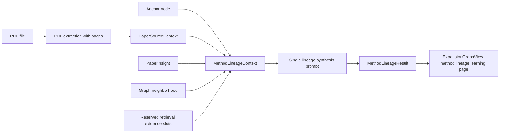

# PDF-Grounded Method Lineage Expansion Design

**Date:** 2026-06-01
**Status:** Draft for user review
**Scope:** Redesign the `track_method_lineage` expansion path so it produces a novice-friendly, current-paper-anchored method lineage explanation grounded in the original PDF text, with inline evidence excerpts in the UI.

## 1. Goal

The current expansion result for method or algorithm nodes is too thin: it often reads like a compact summary for someone who already understands the field. The next iteration should make method lineage expansion answer a more pedagogical question:

```text
What problem is this paper's method responding to, how did nearby methods evolve, and where does the current paper sit in that lineage?
```

The first vertical slice focuses on `track_method_lineage`. It should improve context quality, prompt output, data shape, and UI presentation together instead of only polishing the visual layer.

## 2. Product Decisions

This design is based on the following accepted decisions:

- The first target is the method lineage path, not a broad rewrite of every expansion type.
- The target reader is a beginner or near-beginner who needs to be guided into the concept, while still keeping the current paper as the anchor.
- The first version uses the current PDF plus model knowledge. Real external retrieval evidence can be added later, but the data structure should reserve places for it.
- The final lineage synthesis prompt receives the PDF-derived source text directly. It should not rely on a mandatory intermediate summary or two-stage grounding pass.
- No token fallback strategy is needed for the first version because the intended DeepSeek model setup supports a very large context window.
- The result UI must show PDF evidence excerpts inline inside the explanation flow.

## 3. DeepSeek API Constraint

DeepSeek's official Chat Completion API accepts text message content. Its Anthropic-compatible API documentation also notes unsupported document blocks. Therefore, the first implementation should not assume that the app can send a raw PDF file object directly to DeepSeek and let the model read the binary/document itself.

The source of truth should still be the original PDF file, but the API input for DeepSeek should be high-fidelity extracted text with page metadata:

```ts
interface PaperSourceContext {
  pdfPath: string
  extractedText: string
  pages: Array<{
    pageNumber: number
    text: string
  }>
  sections?: Array<{
    title: string
    text: string
    pageRange?: string
  }>
}
```

The UI should use `pdfPath` and page numbers to let users trace evidence back to the original PDF when extraction loses formulas, tables, or layout.

## 4. Data Flow

Recommended flow:



The important shift is that `PaperInsight` is no longer the primary evidence source. It remains useful as an existing system interpretation and fallback, but the final method lineage prompt should ground its claims in `paperSource.extractedText` and `paperSource.pages`.

## 5. MethodLineageContext

Create a context object for the method lineage path:

```ts
interface MethodLineageContext {
  anchor: {
    nodeId: string
    label: string
    type?: string
    expansionType?: string
    description?: string
    classificationRationale?: string
  }
  paperSource: PaperSourceContext
  paperInsight?: {
    title?: string
    summary?: string
    problem?: string
    method?: string
    contribution?: string
    limitations?: string
  }
  localGraphNeighborhood: {
    nodes: Array<{
      id: string
      label: string
      type?: string
      description?: string
    }>
    edges: Array<{
      source: string
      target: string
      label?: string
      description?: string
    }>
  }
  evidenceSlots: Array<{
    id: string
    sourceType: 'current_pdf' | 'model_knowledge' | 'retrieved_paper'
    title?: string
    year?: number
    citation?: string
    note?: string
    confidence?: number
  }>
  readerIntent: 'novice_paper_anchored_lineage'
}
```

`evidenceSlots` should support future retrieval without becoming required in the first implementation. For this vertical slice, most evidence should come from `current_pdf`; model knowledge can be used to explain general background, but the output must mark it as such.

## 6. Prompt Contract

The lineage prompt should ask the model to use the full extracted PDF text as the primary source for the current paper's problem, method, contribution, and limitations.

Prompt responsibilities:

- Explain the method lineage for a reader who may not know the field.
- Start from the problem setting, not from a list of papers.
- Identify the current paper's method position using PDF evidence.
- Use model knowledge for broader lineage context, but label it separately from PDF-grounded claims.
- Prefer concrete method differences over vague summaries.
- Return short evidence excerpts with page references for claims about the current paper.
- Avoid pretending that unverified external papers are retrieved evidence.

Output shape:

```ts
interface MethodLineageResult {
  title: string
  problemSetup: {
    beginnerExplanation: string
    whyThisProblemMatters: string
    pdfEvidence: PdfEvidenceRef[]
  }
  conceptBridge: Array<{
    concept: string
    explanation: string
    whyNeededForThisLineage: string
    pdfEvidence?: PdfEvidenceRef[]
  }>
  lineageMap: {
    stages: MethodLineageStage[]
    edges: MethodLineageEdge[]
  }
  anchorPosition: {
    summary: string
    whatTheCurrentPaperChanges: string
    whatItInherits: string[]
    whatItDoesNotSolve: string[]
    pdfEvidence: PdfEvidenceRef[]
  }
  methodComparisons: Array<{
    methodA: string
    methodB: string
    keyDifference: string
    whyItMatters: string
    evidence: EvidenceRef[]
  }>
  openQuestions: Array<{
    question: string
    whyItRemainsOpen: string
    evidence: EvidenceRef[]
  }>
  readingPath: Array<{
    step: string
    goal: string
    relatedStageIds: string[]
  }>
  confidenceAndEvidence: {
    groundedInCurrentPdf: string[]
    fromModelKnowledge: string[]
    needsFutureRetrieval: string[]
  }
}

interface MethodLineageStage {
  id: string
  label: string
  role:
    | 'problem_origin'
    | 'foundation_method'
    | 'parallel_variant'
    | 'improvement'
    | 'current_paper_method'
    | 'open_problem'
  beginnerSummary: string
  technicalSummary: string
  representativeMethods: string[]
  evidence: EvidenceRef[]
}

interface MethodLineageEdge {
  sourceId: string
  targetId: string
  relation:
    | 'motivates'
    | 'extends'
    | 'contrasts_with'
    | 'solves_limitation_of'
    | 'shares_assumption_with'
    | 'leaves_open'
  explanation: string
  confidence: number
  evidence: EvidenceRef[]
}

type EvidenceRef = PdfEvidenceRef | ModelKnowledgeEvidenceRef | FutureRetrievalEvidenceRef

interface PdfEvidenceRef {
  sourceType: 'current_pdf'
  pageNumber?: number
  sectionTitle?: string
  excerpt: string
  claimSupported: string
}

interface ModelKnowledgeEvidenceRef {
  sourceType: 'model_knowledge'
  note: string
  confidence: number
}

interface FutureRetrievalEvidenceRef {
  sourceType: 'future_retrieval_needed'
  reason: string
}
```

The output should be verbose enough to teach, but structured enough that the renderer does not have to parse prose.

## 7. UI Design

Use a method-lineage-specific renderer inside the expansion workspace instead of forcing every result through a generic graph summary.

The selected layout is **teaching sections with inline evidence**:

```text
MethodLineageLearningView
  -> Problem Setup
     -> beginner explanation
     -> inline PDF evidence excerpts
  -> Concept Bridge
     -> prerequisite concepts with short explanations
     -> inline evidence where tied to the paper
  -> Lineage / Evolution Map
     -> stages and relations
     -> current paper visually highlighted
  -> Current Paper Position
     -> what it changes
     -> what it inherits
     -> what remains unsolved
     -> inline PDF evidence excerpts
  -> Method Comparisons
     -> concrete differences
     -> evidence tags
  -> Open Questions
  -> Reading Path
```

Inline evidence cards should show:

```text
Section / page
Original excerpt
Claim supported
Open PDF page action when available
```

This is intentionally not a side evidence panel. The evidence should appear at the point where the user needs it, so the reading flow remains pedagogical.

The existing "谱系/演进图" label should remain visible in the method lineage view, but the graph should become one part of the learning page rather than the entire experience.

## 8. Renderer Compatibility

Existing KG4 records and expansion records must continue to render.

Rules:

- If `methodLineageView` or the new lineage result exists, render the method lineage learning view.
- If only older `methodLineageView` fields exist, map them into the new sections where possible and show a partial state.
- If only generic `expansionGraphNodes` exist, keep the current graph fallback.
- Never send users to an empty `ExpandView` when there are no idea cards or comparison-ready method nodes.
- If PDF evidence excerpts are missing, show a clear "evidence unavailable" state instead of hiding the section silently.

## 9. Error Handling

This design removes token fallback from the first version, but it still needs normal failure handling:

- Missing PDF source: fall back to existing `paperInsight` and graph context, but mark the result as not PDF-grounded.
- PDF extraction failure: show a clear expansion failure or partial state explaining that original-paper evidence could not be prepared.
- LLM output missing evidence: keep the explanation if usable, but mark evidence sections as incomplete.
- LLM output references invalid page numbers: keep the excerpt text, remove invalid page links, and flag evidence as unverified.
- JSON validation failure: retry or use the existing readable fallback path rather than rendering broken data.

## 10. Testing Strategy

Unit tests:

- Build `MethodLineageContext` with `paperSource` from a mocked extracted PDF.
- Verify `paperInsight` is optional and secondary.
- Validate `MethodLineageResult` evidence references.
- Normalize missing or invalid PDF evidence.
- Map old lineage records into the new view model.

Prompt/schema tests:

- The prompt includes extracted PDF text and page metadata.
- The prompt requires evidence excerpts for current-paper claims.
- The prompt distinguishes `current_pdf`, `model_knowledge`, and `future_retrieval_needed`.
- Mocked output with inline evidence renders without parsing free-form prose.

Renderer tests:

- The method lineage page renders the "谱系/演进图" heading.
- Problem setup includes inline PDF evidence.
- Current paper position includes evidence excerpts and page labels.
- Evidence cards show claim-supported text and PDF page actions when available.
- Records without evidence render an explicit incomplete state.
- Generic expansion records still use the existing fallback view.

Manual verification:

- Expand a method node from a real PDF.
- Confirm the generated explanation is beginner-readable.
- Confirm evidence excerpts appear inline, not in a separate unrelated panel.
- Confirm the current paper is visibly highlighted in the lineage/evolution graph.

## 11. Non-Goals

This vertical slice should not include:

- Real external paper retrieval as a required evidence source.
- A two-stage PDF summarization or grounding pass.
- A token truncation or fallback strategy.
- A full rewrite of concept teaching, research area, or related-paper paths.
- Raw PDF binary upload to DeepSeek unless official API support changes.
- A complete citation graph or publication-quality survey.

## 12. Success Criteria

The implementation is successful when:

- Method lineage expansion uses PDF-derived source text as its primary context.
- The result explains the problem, lineage, current paper position, method differences, and open questions in a beginner-friendly way.
- Claims about the current paper are grounded with inline PDF excerpts.
- The page visibly includes "谱系/演进图" and highlights the current paper's method position.
- The UI feels like a guided learning page, not a thin summary or flat paper list.
- Existing expansion records continue to render safely.

